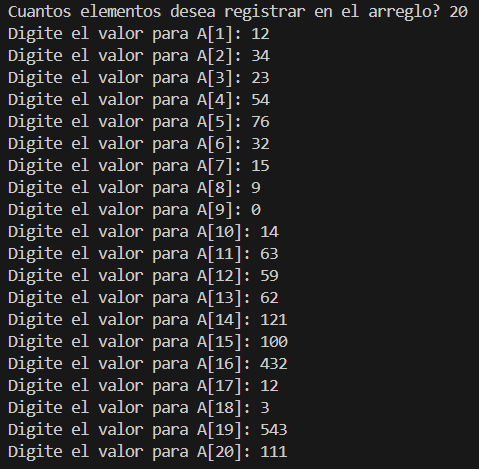
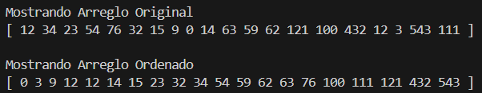

# Quick Sort Algorithm

  


A simple yet effective implementation of the **Quick Sort** algorithm in C++.  
This project allows users to input the size of an array, enter its elements, and see the array sorted using Quick Sort.

---

## ✨ Features

- User-defined array size and elements
- Sorting using the Quick Sort algorithm
- Modular code structure (headers and source files separated)
- Precompiled executable included for convenience

---
## 📁 Project Structure
Quick-Sort-ALgorithm/
├── include/
│ ├── functions_menu.h
│ └── quick_sort.h
├── src/
│ ├── functions_menu.cpp
│ └── quick_sort.cpp
├── main.cpp
└── QuickSort.exe

---

## 📸 Screenshots

**Step 1: Input data**  
Enter the data requested by the program:



**Step 2: See the results**  
Then the initial list and the sorted list will be displayed:



---

## ⚙️ Installation

Clone this repository and run the app locally with just a few commands:

```bash
git clone https://github.com/Luis3Fernando/Quick-Sort-Algorithm
```
```bash
cd Quick-Sort-Algorithm
```
```bash
g++ main.cpp src/functions_menu.cpp src/quick_sort.cpp -I include -o QuickSort
```

```bash
./QuickSort #or QuickSort.exe
